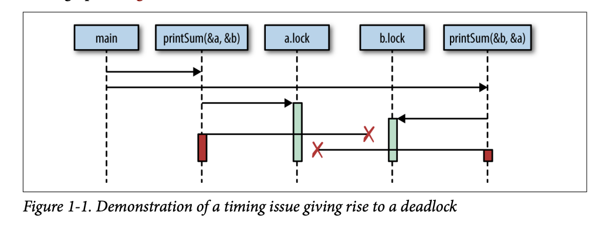

# Deadlock Example in Go

This example demonstrates a classic deadlock scenario using two mutexes and two goroutines in Go.

## How Deadlock Happens

When two goroutines attempt to lock two resources (mutexes) in opposite order, a deadlock can occur. In this example, both goroutines lock one mutex and then try to lock the other, but each holds the lock the other needs, causing both to wait forever.

## Code

```go
// ...existing code...
type value struct {
    mu sync.Mutex
    value int
}

func main() {
    var wg sync.WaitGroup
    printSum := func(v1, v2 *value) {
        defer wg.Done()
        v1.mu.Lock()
        defer v1.mu.Unlock()
        time.Sleep(2 * time.Second)
        v2.mu.Lock()
        defer v2.mu.Unlock()
        fmt.Printf("sum=%v\n", v1.value+v2.value)
    }

    var a, b value
    wg.Add(2)
    go printSum(&a, &b)
    go printSum(&b, &a)
    wg.Wait()
}
```

## Visualization

The diagram below shows how the deadlock occurs:



*Figure 1-1. Demonstration of a timing issue giving rise to a deadlock*

- The first goroutine locks `a.mu` and tries to lock `b.mu`.
- The second goroutine locks `b.mu` and tries to lock `a.mu`.
- Both goroutines are now waiting for each other to release the lock, resulting in a deadlock.

## How to Run

From the `deadlock` directory, run:
```sh
go run deadlock.go
```
The program will hang and never print the sum, demonstrating a deadlock.

## Learn More
- [Go sync package](https://pkg.go.dev/sync)
- [Deadlock (Wikipedia)](https://en.wikipedia.org/wiki/Deadlock)
